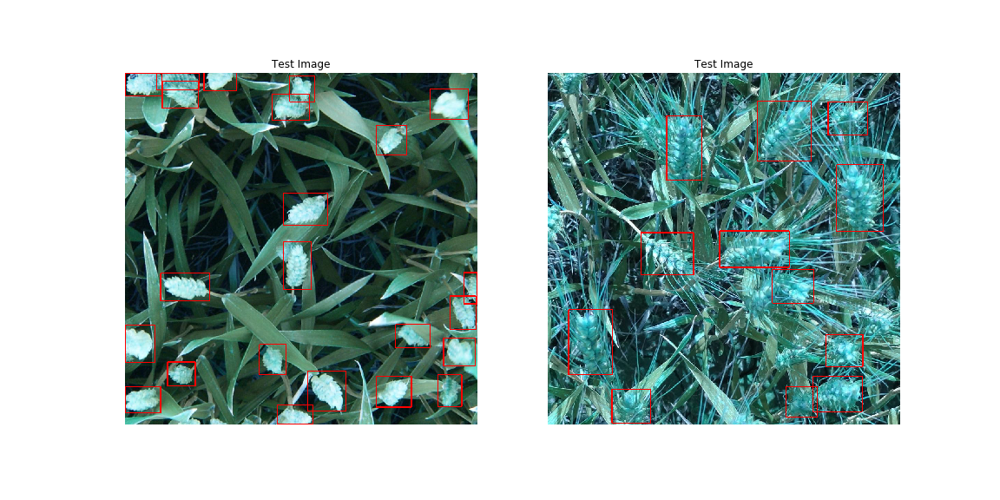
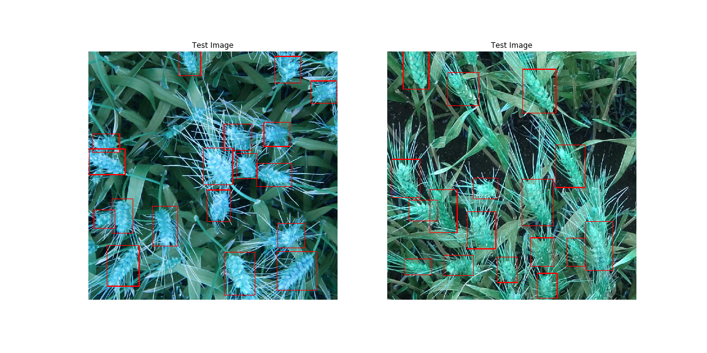
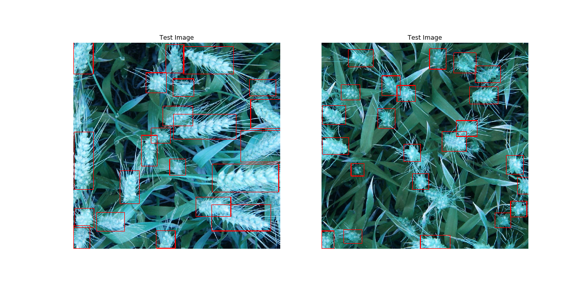
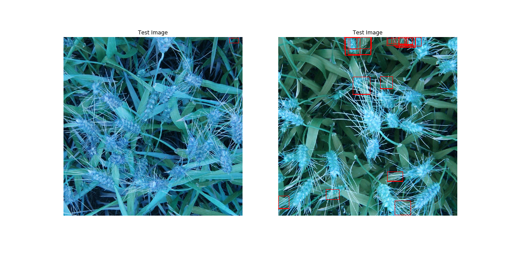
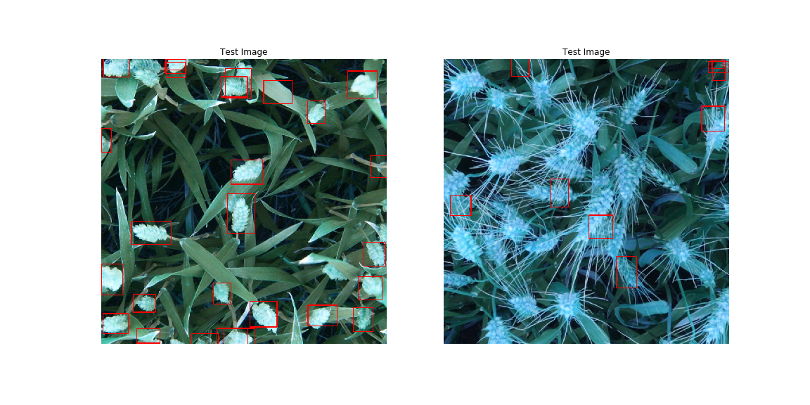

# Wheat Head Detection
## Implementing Tensorflow Object Detection API for custom data

The inspiration of this repo is an active [Kaggle competition](https://www.kaggle.com/c/global-wheat-detection) hosted by the University of Saskatchewan to design an Object Detection model to identify wheat heads. Because this is an active contest, I have not included the data or any of my TFRecord files, but rather the data can be found [here](https://www.kaggle.com/c/global-wheat-detection/data). 

## Data Preparation

This was a clean dataset- all images were a uniform size and the training set was annotated with boundary boxes. I [did remove](https://github.com/asoane34/TF_object_detection/blob/master/00EDA.ipynb) a handful of boundary boxes that were clearly mislabeled, but the primary data preparation step is to [prepare TFRecord files](https://github.com/asoane34/TF_object_detection/blob/master/generate_tfrecords.py). The TFRecord format is explained in detail [here](https://www.tensorflow.org/tutorials/load_data/tfrecord), but it is a lightweight, efficient format for storing data in the form of [protocol buffers](https://developers.google.com/protocol-buffers/). This is the input format that the Tensorflow Object Detection API expects. 

## Data Augmentation

The TF object detection API supports many different data augmentation techniques: Random flipping, random rotation, random cropping, random RGB to gray, random padding, etc. Because initial modeling efforts did not translate well to the validation set and the test set, I implemented two data augmentation techniques:
* [Random Image Cropping](https://github.com/tensorflow/models/blob/master/research/object_detection/protos/preprocessor.proto) - Randomly crop images with probability of $50\%$ to an image area somewhere between $$\frac{1}{10}$$th and $$\frac{99}{100}$$th of the original image area, contingent upon there being at least one boundary box in the cropped image. 
* [Random RGB to Gray](https://github.com/tensorflow/models/blob/master/research/object_detection/protos/preprocessor.proto)- Randomly change images from an RGB color image to grayscale with a probability of $10\%$. 

## Model Selection
[The TF Model Zoo](https://github.com/tensorflow/models/blob/master/research/object_detection/g3doc/detection_model_zoo.md) provides a collection of object detection model frameworks and architectures: Faster R-CNN, SSD, Mask R-CNN. Models have been trained on a variety of famous datasets: COCO, Kitti, iNaturalist, OpenImages, etc. When selecting the correct model, the key determination is the accuracy / latency trade-off. SSDs, for example, are much lighter weight implementations than Faster R-CNN and can be useful in mobile appliations, but they are not going to be as accurate. In this particular case, accuracy is more important than latency. The goal is to identify wheat-heads as precisely as possible from a given image; we are not trying to pick up wheat heads on the fly from video or anything like that. To this end, the first model I selected was an implementation of [Faster R-CNN](faster_rcnn_resnet101_fgvc.config) with a ResNet101 base, originally trained on the iNaturalist dataset. However, after $120,000$ steps, the detection was still quite poor:

Instead of training for hundreds of thousands more steps, I elected to move to a different implementation of Faster R-CNN: [Faster R-CNN with Inception Resnet v2, Atrous version](https://github.com/tensorflow/models/blob/master/research/object_detection/samples/configs/faster_rcnn_inception_resnet_v2_atrous_coco.config). 

## Model Training 

The API interface for training the model is to create a pipeline.config file, in the format of a protocol buffer, that specifies image preprocessing steps, model parameters, training hyperparameters, data augmentation methods, and training and validation set paths. Config files for each model in the model zoo can be found [here](https://github.com/tensorflow/models/tree/master/research/object_detection/samples/configs). These config files are configured to the respective dataset they are trained on, and they need to be adapted to a custom dataset. The parameters that need to be updated: 
* num_classes - The number of unique classes to be identified. 
* first_stage_max_proposals - In the first stage, how many regions to propose. This is important to adjust if there are hundreds of objects per image and the model config file is limiting to a handful of proposals. 
* max_detections_per_class and max_total_detections - Specifying the maximum number of objects there can be per image. 
* score_converter: TF OD API supports three score converters: SOFTMAX, SIGMOID, AND LINEAR. Obviously in the one class case, I chose SIGMOID. 
* manual_step_learning_rate - The learning rate decay schedule was set to a $200,000$ step. The whole point of transfer learning is to avoid $200,000$ steps of training, so I adjusted the learning rate schedule to decay over $20,000$ steps. 
* data_augmentation_options: I added Random Image Cropping and Random RGB to Gray.
* train_input_reader: Specifying the location of the training TFRecords and the class label map. 
* eval_input_reader: Specifying the location of the validation set TFRecords as well as the label map. 

I trained the model with a GPU runtime in [Google colab](https://colab.research.google.com/). I subscribe to Google Colab Pro, which gives access to much superior GPUs (NVIDIA P100 Telsa in this case). $20,000$ steps took ~6 hours to train, and at the end of the training run the average precision of the validation class was consistently around $0.84$. 

## Results
The majority of the test set on Kaggle is hidden. However, they do provide 10 test images, and I have included these images at the top of the README.
