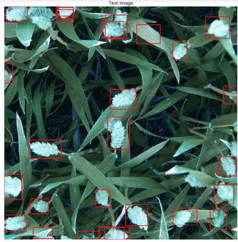

# TF_object_detection
Implementing TF Object Detection API for custom dataset. 

The inspiration of this repo is an active [Kaggle competition](https://www.kaggle.com/c/global-wheat-detection) hosted by the University of Saskatchewan to design an Object Detection model to identify wheat heads. Because this is an active contest, I have not included the data or any of my TFRecord files, but rather the data can be found [here](https://www.kaggle.com/c/global-wheat-detection/data). 

# Contents
## 00EDA.ipynb
Data exploration of images and bounding box data. Visualize distibution of bounding boxes as well as source distribution.

## 01TFRecord_test.ipynb
Inspected created TFRecord files and validated TFRecord Dataset. 

## 02FasterRCNNResNet101FGVC.ipynb
Google Colab Notebook - trained 120000 steps with [Faster RCNN ResNet101](https://github.com/tensorflow/models/blob/master/research/object_detection/samples/configs/faster_rcnn_resnet50_fgvc.config) trained on iNaturalist species dataset. 

## 02.1TestImageInference.ipynb
Examing model inferences on test images at different step levels. (Ongoing)
